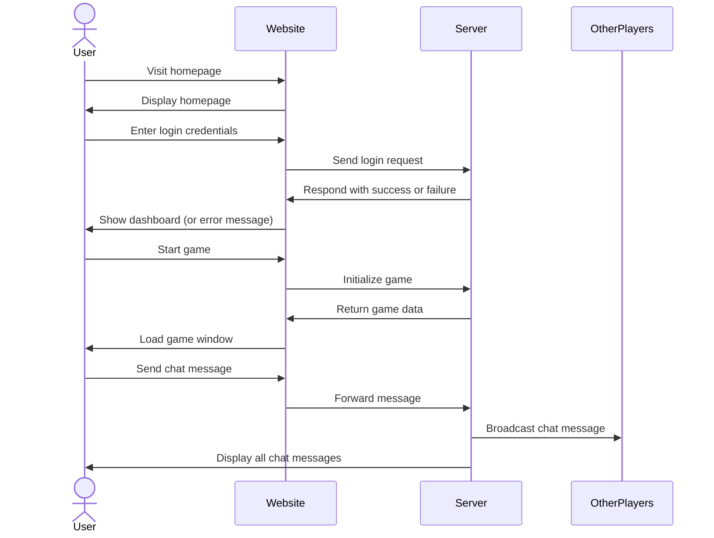

# Catch Phrase Online

[My Notes](notes.md)

> [!NOTE]
>  This is a template for your startup application. You must modify this `README.md` file for each phase of your development. You only need to fill in the section for each deliverable when that deliverable is submitted in Canvas. Without completing the section for a deliverable, the TA will not know what to look for when grading your submission. Feel free to add additional information to each deliverable description, but make sure you at least have the list of rubric items and a description of what you did for each item.

> [!NOTE]
>  If you are not familiar with Markdown then you should review the [documentation](https://docs.github.com/en/get-started/writing-on-github/getting-started-with-writing-and-formatting-on-github/basic-writing-and-formatting-syntax) before continuing.

## 🚀 Specification Deliverable

> [!NOTE]
>  Fill in this sections as the submission artifact for this deliverable. You can refer to this [example](https://github.com/webprogramming260/startup-example/blob/main/README.md) for inspiration.

For this deliverable I did the following. I checked the box `[x]` and added a description for things I completed.

- [X] Proper use of Markdown
- [X] A concise and compelling elevator pitch
- [X] Description of key features
- [X] Description of how you will use each technology
- [X] One or more rough sketches of your application. Images must be embedded in this file using Markdown image references.

### Elevator pitch

Catch Phrase is a word game where you try to explain your random generated word to your teamates so that they can guess it. After guessing the word it is now the other teams turn, but be careful if the buzzer goes off while you're still trying to guess the word, your team loses and the other team moves their piece forward 1 spot. The game is over when a team's piece reaches the end, which means they are the winners. The webiste will host this game online where individuals can make accounts and play with their friends with a game/room code while chatting.

### Design
Intro Page

Create Account(can be a pop up window on intro page)

Game

Rules

### Key features

- Login/register: Each player is required to make an account to play the game meaning each player has a unique username that will be displayed when playing the game with others. All stored on database
- Catch Phrase game: The game is displayed for everyone to see their team pieces on the board. Each user is randomly assigned a team(equal number on both sides). Players try to guess what the word is depending on the description
                     their teamate gives them, which appears to everyone in the game. Keep going until buzzer is sounded
- Chat bar below the game for general chat amongst everyone

### Technologies

I am going to use the required technologies in the following ways.

- **HTML** - Basic Structure, will need two maybe three html pages for home, game, and account. Rules and other things will be pop up text boxes
- **CSS** - Making the Structure look more creative and animation of the game
- **React** - User authentication, game info, display teammate guesses and chat, backend endpoint calls
- **Service** - Backend service with endpoints to:
    - Submitting guesses
    - Managing game state(buzzer, win condition, words, turns, score, etc)
    - User authentication
    - **APIs**
      - Auth0(login authentication)
      - Meriam Webster Dictionary
- **DB/Login** - Store users in database, which must register and sign in to play the game. Credentials securely stored in database. Potential to add a friend list
- **WebSocket** - game state synchronization, displaying chat messages & words

## 🚀 AWS deliverable

For this deliverable I did the following. I checked the box `[x]` and added a description for things I completed.

- [x] **Server deployed and accessible with custom domain name** - [My server link](https://cs260-catchphrase.click/).

## 🚀 HTML deliverable

For this deliverable I did the following. I checked the box `[x]` and added a description for things I completed.

- [x] **HTML pages** - 4 pages for each of the different functions of my website. Names are self-explanatory and index is the homepage
- [x] **Proper HTML element usage** - Mainly used headers, tables, divs, and paragraphs with general classes and unique ids to separate my content, which I will further style with CSS to create more distinction
- [x] **Links** - I created multiple hrefs for navigation links or links to other places
- [x] **Text** - I completed this part with various text throughout my site
- [x] **3rd party API placeholder** - I explicitly commetted in both text and comments on where my apis will go 
- [x] **Images** - I inserted images using img src method, images are uploaded to my repo
- [x] **Login placeholder** - There are sign in boxes and a submit button
- [x] **DB data placeholder** - There are tables that will eventually pull out your information like username
- [x] **WebSocket placeholder** - There is a live chat box with a placeholder for the websocket.

## 🚀 CSS deliverable

For this deliverable I did the following. I checked the box `[x]` and added a description for things I completed.

- [x] **Header, footer, and main content body** - Header contains the webnavigation, and Footer contains the live chat, which are styled accordling on the game page. The other pages I didn't need to use header or footer. Main contains most of my styling, which I organized with bootstrap and overided with CSS when needed.
- [x] **Navigation elements** - Navigation has been given a background color along with "buttons" that are gray and change color as you hover over them. Also added a section for your Username to show up.
- [x] **Responsive to window resizing** - I mainly used bootstrap to organize the layout of my pages, which meant that I could resize easily. You'll notice that the "column" sectionns of the page switch their orientation as you make your window smaller.
- [x] **Application elements** - I used bootstrap for the basics and overrided with some css for various elements in my website such as headers, paragraphs, buttons, and tables. Tables especially took me a while to figure out how to properly style them with alternating colors for various rows.
- [x] **Application text content** - I changed the font, color, size, and if it was bold depending on what the text contained and where it was located. I even imported a font called Anton for my Catchphrase title.
- [x] **Application images** - The main thing I did with this was layer the board pieces on top of the actual game board and position them in a nice way, which took a long time to get right. A lot of pixel incrementing. 

## 🚀 React part 1: Routing deliverable

For this deliverable I did the following. I checked the box `[x]` and added a description for things I completed.

- [ ] **Bundled using Vite** - I did not complete this part of the deliverable.
- [ ] **Components** - I did not complete this part of the deliverable.
- [ ] **Router** - Routing between login and voting components.

## 🚀 React part 2: Reactivity

For this deliverable I did the following. I checked the box `[x]` and added a description for things I completed.

- [ ] **All functionality implemented or mocked out** - I did not complete this part of the deliverable.
- [ ] **Hooks** - I did not complete this part of the deliverable.

## 🚀 Service deliverable

For this deliverable I did the following. I checked the box `[x]` and added a description for things I completed.

- [ ] **Node.js/Express HTTP service** - I did not complete this part of the deliverable.
- [ ] **Static middleware for frontend** - I did not complete this part of the deliverable.
- [ ] **Calls to third party endpoints** - I did not complete this part of the deliverable.
- [ ] **Backend service endpoints** - I did not complete this part of the deliverable.
- [ ] **Frontend calls service endpoints** - I did not complete this part of the deliverable.

## 🚀 DB/Login deliverable

For this deliverable I did the following. I checked the box `[x]` and added a description for things I completed.

- [ ] **User registration** - I did not complete this part of the deliverable.
- [ ] **User login and logout** - I did not complete this part of the deliverable.
- [ ] **Stores data in MongoDB** - I did not complete this part of the deliverable.
- [ ] **Stores credentials in MongoDB** - I did not complete this part of the deliverable.
- [ ] **Restricts functionality based on authentication** - I did not complete this part of the deliverable.

## 🚀 WebSocket deliverable

For this deliverable I did the following. I checked the box `[x]` and added a description for things I completed.

- [ ] **Backend listens for WebSocket connection** - I did not complete this part of the deliverable.
- [ ] **Frontend makes WebSocket connection** - I did not complete this part of the deliverable.
- [ ] **Data sent over WebSocket connection** - I did not complete this part of the deliverable.
- [ ] **WebSocket data displayed** - I did not complete this part of the deliverable.
- [ ] **Application is fully functional** - I did not complete this part of the deliverable.
